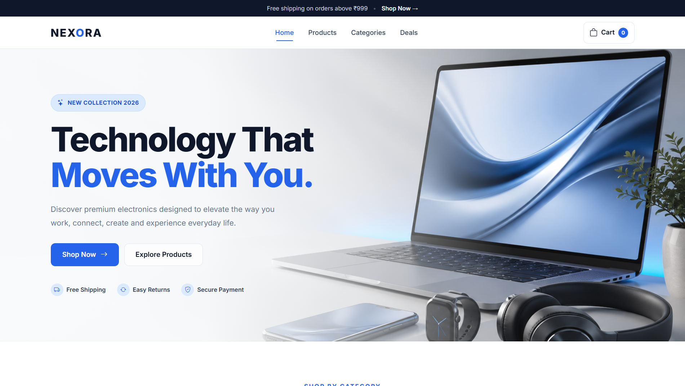
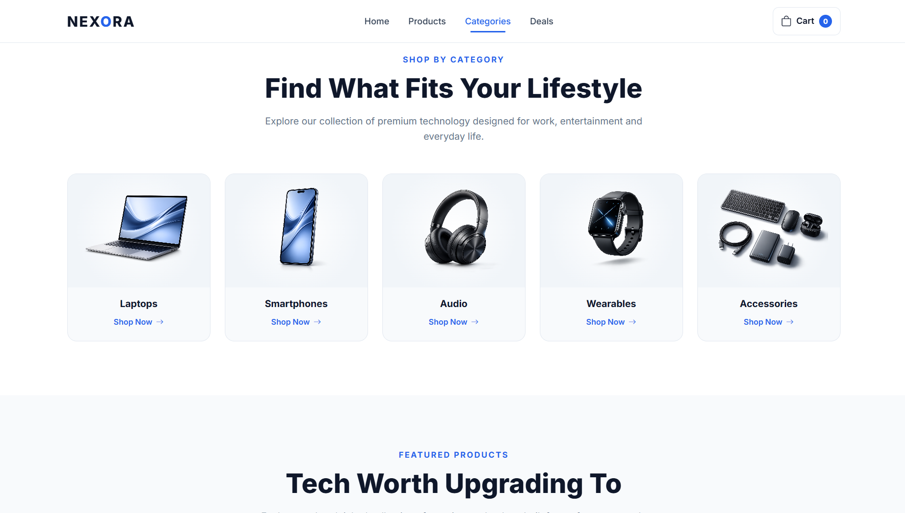
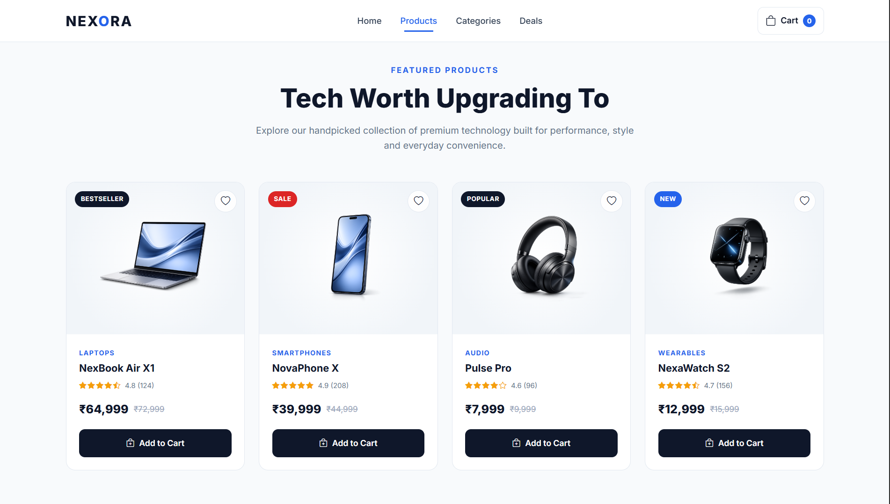
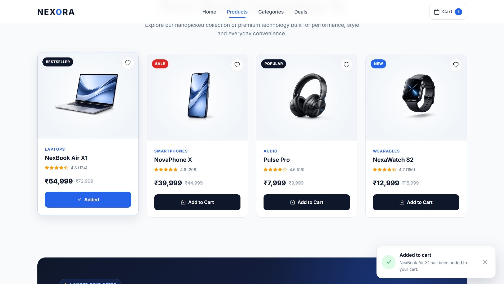
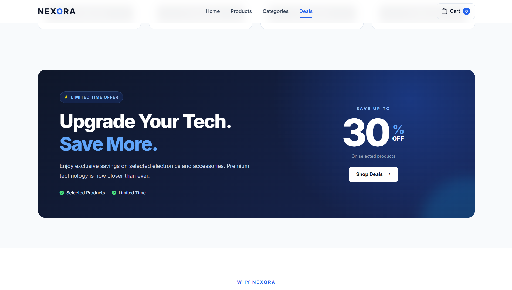
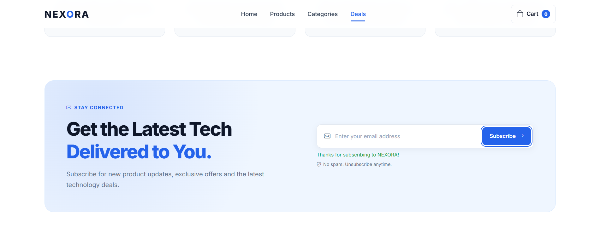
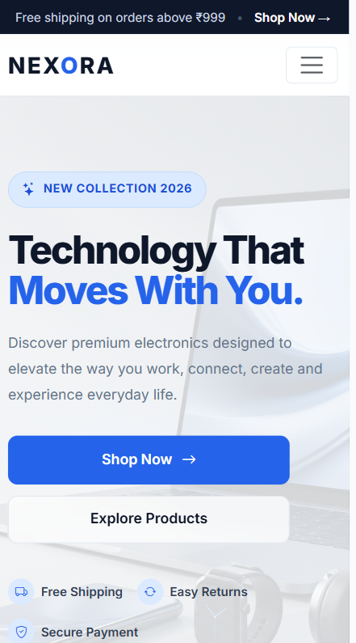
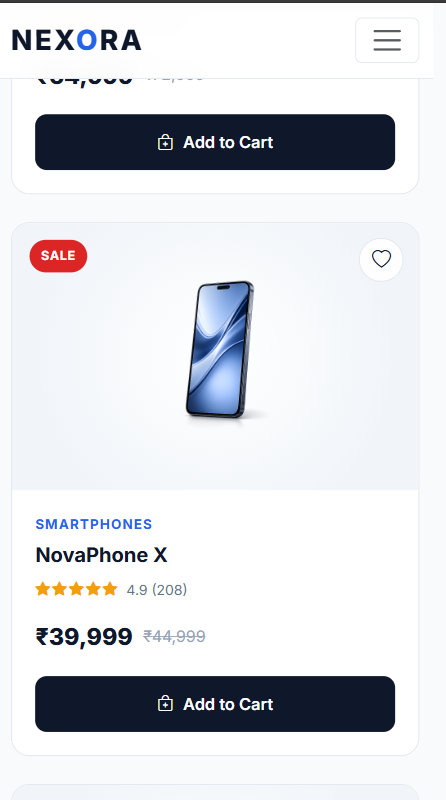

# 🛒 NEXORA — Responsive E-Commerce Landing Page

> A modern and responsive electronics e-commerce landing page built with HTML5, CSS3, Bootstrap 5, and Vanilla JavaScript.

NEXORA was developed as part of **Internship Task 2: Create a Responsive Web Page**. The project demonstrates responsive web design, Bootstrap fundamentals, e-commerce UI concepts, and interactive JavaScript functionality.

---

## 📌 Internship Task 2 — Create a Responsive Web Page

### Description

The objective of this task is to create a responsive webpage using **HTML, CSS, and Bootstrap/Tailwind CSS**.

The webpage should be visually appealing, responsive across different screen sizes, and demonstrate a basic understanding of modern web design.

Interactive functionality should also be implemented using **Vanilla JavaScript**, such as form validation, toggle functionality, or other user interactions.

For this task, I developed **NEXORA**, a responsive electronics e-commerce landing page.

### Skills

- HTML5
- CSS3
- Bootstrap 5
- Vanilla JavaScript
- Responsive Web Design
- Basic E-Commerce Concepts
- Front-End UI Development

---

## 📖 Project Overview

**NEXORA** is a fictional premium electronics e-commerce website designed to demonstrate responsive front-end web development.

The website presents electronics such as laptops, smartphones, headphones, smartwatches, and accessories through a modern shopping interface.

The project includes product categories, featured products, pricing, ratings, promotional offers, cart interactions, wishlist functionality, newsletter validation, shopping benefits, and a responsive footer.

NEXORA goes beyond a simple static landing page by including interactive Vanilla JavaScript functionality and responsive behavior across desktop, tablet, and mobile devices.

---

## ✨ Features

### 🛍️ Shopping Experience

- Product category browsing
- Featured product cards
- Product images
- Product ratings
- Product pricing
- Discounted pricing
- Product badges
- Add to Cart functionality
- Wishlist functionality

### 🛒 Cart Interaction

- Interactive Add to Cart buttons
- Dynamic cart counter
- Temporary Added state
- Add-to-cart success notification

### ❤️ Wishlist

- Interactive wishlist toggle
- Heart icon state change

```text
♡ → ♥
```

### 🎁 Promotions

- Promotional announcement bar
- Hero promotional content
- Special deals section
- Product discounts and offers

### 🚚 Shopping Benefits

- Free shipping information
- Secure payment information
- Easy returns information
- Customer support information

### 📧 Newsletter

- Newsletter subscription form
- Empty-field validation
- Email-format validation
- Success feedback

### 📱 User Experience

- Responsive navigation
- Mobile hamburger menu
- Responsive hero section
- Responsive product cards
- Smooth scrolling
- Responsive footer
- Custom favicon
- Mobile-friendly interface

---

## 🧠 Concepts Demonstrated

### Responsive Web Design

NEXORA uses responsive layouts to adapt the interface to different screen sizes.

The design combines:

- Bootstrap responsive grid
- Flexible layouts
- CSS media queries
- Responsive images
- Adaptive spacing
- Mobile-friendly navigation

---

### Bootstrap Grid System

Bootstrap 5 is used to organize sections and product cards into responsive rows and columns.

The layout automatically adapts according to the available screen width.

---

### DOM Manipulation

Vanilla JavaScript is used to access and update elements in the webpage dynamically.

This enables functionality such as:

- Updating the cart counter
- Changing button states
- Toggling wishlist icons
- Displaying notifications
- Showing newsletter feedback

---

### Event Handling

JavaScript event listeners respond to user interactions such as:

- Clicking Add to Cart
- Clicking wishlist buttons
- Submitting the newsletter form
- Opening mobile navigation

---

### Form Validation

The newsletter form validates user input before accepting a subscription.

The validation checks for:

- Empty email input
- Invalid email format
- Valid email format

---

## ⚡ JavaScript Features

### Add to Cart

When the user clicks **Add to Cart**:

1. The cart counter increases.
2. The selected product is added to the simulated cart.
3. The button temporarily displays an **Added** state.
4. A success notification appears.

This interaction is implemented entirely using Vanilla JavaScript.

---

### Wishlist Toggle

Users can click the heart icon on product cards to change the wishlist state.

```text
Not Wishlisted
      ↓
      ♡
      ↓
User clicks
      ↓
      ♥
      ↓
Wishlisted
```

Clicking again removes the wishlist state.

---

### Newsletter Validation

When the newsletter form is submitted, JavaScript checks the entered email address.

```text
User submits email
        ↓
Empty?
 ├── Yes → Show validation message
 └── No
        ↓
Valid format?
 ├── No → Show invalid email message
 └── Yes → Show success message
```

---

## 🛠️ Technologies Used

| Technology | Purpose |
|---|---|
| HTML5 | Website structure and semantic content |
| CSS3 | Custom styling and responsive design |
| Bootstrap 5 | Responsive grid and layout utilities |
| Vanilla JavaScript | Interactive functionality |
| Bootstrap Icons | Interface icons |
| Google Fonts | Website typography |
| Git | Version control |
| GitHub | Source code hosting |
| Cloudflare | Website deployment |

---

## 📂 Project Structure

```text
Task_2_Responsive_Ecommerce/
│
├── assets/
│   └── images/
│       ├── fav.png
│       ├── hero.jpg
│       ├── laptop.png
│       ├── smartphone.png
│       ├── headphones.png
│       ├── smartwatch.png
│       └── accessories.png
│
├── css/
│   └── style.css
│
├── js/
│   └── script.js
│
├── Output/
│   ├── homepage.png
│   ├── categories.png
│   ├── featured-products.png
│   ├── cart-interaction.png
│   ├── deals.png
│   ├── newsletter.png
│   ├── mobile-home.png
│   └── mobile-products.png
│
├── index.html
└── README.md
```

---

## 📸 Screenshots

### 🏠 Home Page

The main NEXORA interface featuring the promotional bar, navigation, branding, and hero section.



---

### 📂 Product Categories

The Shop by Category section allows users to explore different electronics categories.



---

### 🛍️ Featured Products

Featured product cards display product images, ratings, prices, discounts, badges, wishlist controls, and Add to Cart functionality.



---

### 🛒 Cart Interaction

The cart interaction demonstrates the dynamic cart counter and JavaScript Add to Cart functionality.



---

### 🎁 Deals

The promotional deals section highlights special electronics offers and discounts.



---

### 📧 Newsletter

The newsletter section demonstrates user input handling and JavaScript email validation.



---

### 📱 Mobile Home

The homepage automatically adapts to smaller mobile screens.



---

### 📱 Mobile Products

Product cards reorganize into a mobile-friendly layout for smaller devices.



---

## 💡 How NEXORA Works

### 1. Browse Categories

Users can explore electronics through the category section.

Categories include products such as:

- Laptops
- Smartphones
- Headphones
- Smartwatches
- Accessories

---

### 2. Explore Featured Products

Each featured product provides useful shopping information including:

- Product image
- Product name
- Rating
- Price
- Discount
- Product badge
- Wishlist control
- Add to Cart button

---

### 3. Add Products to Cart

Clicking **Add to Cart** updates the simulated cart and provides immediate visual feedback.

---

### 4. Add Products to Wishlist

Clicking the heart control toggles the product's wishlist state.

---

### 5. Explore Deals

The deals section presents promotional offers designed to resemble a real e-commerce shopping experience.

---

### 6. Subscribe to Newsletter

Users can enter an email address into the newsletter form.

JavaScript validates the input and displays appropriate feedback.

---

## 🛒 E-Commerce Concepts Demonstrated

The project demonstrates several fundamental e-commerce interface concepts:

- Product categories
- Product listings
- Product pricing
- Discounts and promotional offers
- Product ratings
- Shopping cart
- Wishlist
- Product badges
- Promotional deals
- Shipping information
- Secure payment information
- Returns information
- Customer support
- Newsletter subscription

The project focuses on the **front-end shopping experience** and does not implement a real payment gateway, authentication system, or backend database.

---

## 📱 Responsive Design

NEXORA was developed using the **Bootstrap 5 responsive grid system** together with custom CSS media queries.

The website supports:

- Desktop
- Laptop
- Tablet
- Mobile

On smaller screens:

- Navigation changes to a mobile-friendly menu
- Hero content adapts to the available space
- Product cards rearrange automatically
- Category cards adjust according to screen width
- Typography and spacing are optimized
- Newsletter layout adapts
- Footer content becomes mobile-friendly

---

## ⚙️ Getting Started

### 1. Clone the Repository

```bash
git clone <repository-url>
```

---

### 2. Open the Project

```bash
cd Task_2_Responsive_Ecommerce
```

---

### 3. Run the Website

No package installation or build process is required.

Open:

```text
index.html
```

directly in a modern browser.

For development, the project can also be opened using the **Live Server** extension in Visual Studio Code.

---

## 🎯 Learning Outcomes

Through this project, I practiced:

- Creating semantic HTML structures
- Building responsive webpages
- Working with Bootstrap 5
- Understanding the Bootstrap grid system
- Creating responsive navigation
- Designing reusable product cards
- Using CSS media queries
- Working with responsive images
- DOM manipulation with JavaScript
- JavaScript event handling
- Implementing cart interactions
- Implementing toggle functionality
- Validating form input
- Providing user feedback
- Designing mobile-friendly interfaces
- Understanding basic e-commerce UI patterns
- Organizing front-end project files
- Using Git and GitHub
- Deploying a static website

---

## 🚀 Deployment

NEXORA is deployed online using **Cloudflare**.

### Live Website

**Cloudflare Deployment:**  
`https://nexora.charansomisetti56.workers.dev/`

### Source Code

**GitHub Repository:**  
`https://github.com/charansomisetti144-eng/Task_2_Nexora.git`

---

## 🔮 Future Improvements

Possible future enhancements include:

- Individual product detail pages
- Real shopping cart page
- Cart quantity controls
- Product search
- Product sorting
- Category filtering
- User authentication
- Checkout page
- Payment gateway integration
- Backend product database
- Order tracking
- Dark mode
- Persistent wishlist
- Persistent shopping cart

---

## ✅ Internship Task Status

**Task 2: Create a Responsive Web Page — Completed**

| Requirement | Status |
|---|---|
| Create a responsive webpage | ✅ Completed |
| Use HTML5 | ✅ Completed |
| Use CSS3 | ✅ Completed |
| Use Bootstrap | ✅ Completed |
| Add Vanilla JavaScript interactivity | ✅ Completed |
| Implement responsive design | ✅ Completed |
| Demonstrate e-commerce concepts | ✅ Completed |
| Mobile-friendly interface | ✅ Completed |
| Project documentation | ✅ Completed |
| Deployment | ✅ Completed |

### Additional Features Implemented

- Dynamic cart counter
- Add-to-cart feedback
- Wishlist toggle
- Product priorities through badges and offers
- Newsletter email validation
- Promotional deals
- Shopping benefit sections
- Responsive mobile navigation
- Custom favicon
- Cloudflare deployment

---

## 👨‍💻 Author

**SOMISETTI NAGA VEERA SRI CHARAN**

Developed as part of a **Front-End Development Internship — Task 2: Create a Responsive Web Page**.

---

## 📄 Note

**NEXORA is a fictional electronics brand** created solely for educational and internship demonstration purposes.

The products, prices, ratings, discounts, offers, and other information displayed on the website are sample data used to demonstrate front-end e-commerce concepts.

---

## 📄 License

This project was created for **educational and internship demonstration purposes**.